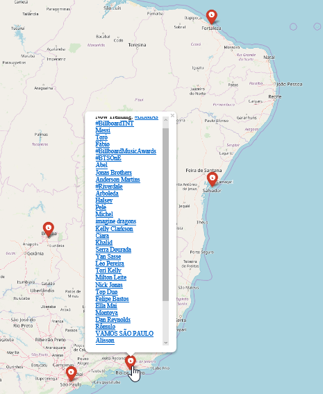

# Trends on a map
Create maps displaying trending tweets using twitter APIs and Folium

### Prerequisites

Twitter API Keys

Tweepy

Folium

### Running Trends on a map
Open trends-on-a-map.py and Enter your API keys.
Add your desired filepath and name into map.save(r"YOUR-FILEPATH\FILENAME.html") (This is where the html file with mapped trending tweets will be saved)

Run the trends-on-a-map.py file

